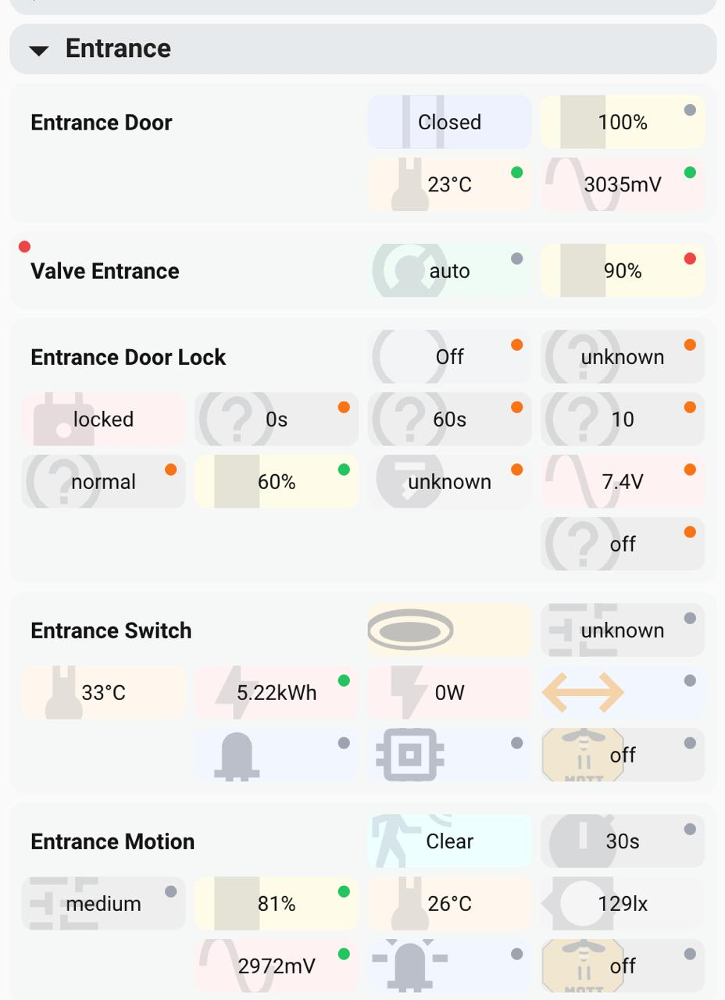

# ha-seagull-device-card

Home Assistant custom card: `custom:seagull-device-card`.

Device-focused card with a live wizard editor (area → device → entity), grouped rendering, badges, and compact status buttons.



## Features

- Interactive wizard tree:
  - Areas (checkbox + expand/collapse)
  - Devices (checkbox + expand/collapse)
  - Entities (checkbox)
- Live config updates (no separate apply/create step)
- Default selection for **new** devices includes key entities only:
  - Domains: `sensor`, `binary_sensor`, `switch`, `light`, `fan`, `cover`, `climate`, `lock`, `button`, `select`, `number`, `input_boolean`
  - Excludes by default: `Identify`, `Firmware`, `Battery voltage`, `configuration/config`
  - Diagnostic is included only for: `battery`, `temperature`, `connection state`, `last seen`, `status`
- Non-destructive removal logic:
  - Clean entries are removed when unchecked
  - Entries with custom config are kept with `disable: true`
  - Re-checking removes `disable: true`
- Card rendering:
  - Grouped by area, then by device
  - Area header badge always shown, collapsible (`▾/▸`)
  - Device title clickable (attempts to open Device Info)
  - Entity buttons aligned by grid, `more-info` on click
- Visual behavior:
  - Large semi-transparent background icon per button
  - `light`/`switch`: icon-only state
  - `unavailable`: diagonal striped fill + hidden text
  - Optional `hide_unavailable`
  - Binary sensor text mapping (e.g. window off → Closed)
  - Unit is appended to sensor value unless `unit_of_measurement: false` on that entity
- Aging badge dots:
  - Per-entity badge (top-right on button)
  - Per-device badge (top-left on device block)
  - Configurable by `last_changed` or `last_updated`

## Installation

### Option A — HACS (recommended)

1. HACS → **Frontend** → **⋮** → **Custom repositories**
2. Add: `https://github.com/avchaykin/ha-seagull-device-card`
3. Category: **Dashboard**
4. Install **Seagull Device Card**
5. Add Lovelace resource:
   - URL: `/hacsfiles/ha-seagull-device-card/seagull-device-card.js`
   - Type: `JavaScript Module`

### Option B — Manual

1. Copy files to HA:
   - `/config/www/seagull-device-card.js`
   - `/config/www/seagull-device-card-loader.js`
2. Add Lovelace resource:
   - URL: `/local/seagull-device-card-loader.js`
   - Type: `JavaScript Module`

## Minimal config

```yaml
type: custom:seagull-device-card
devices: []
```

Tip: start minimal, then configure via visual editor.

## Card options

### Layout / behavior

- `grid_columns` (default: `4`)
- `grid_gap` (default: `6`)
- `button_border_radius` (default: `8`)
- `button_height` (default: `36`)
- `background_icon_scale` (default: `1.7`) — relative to button height
- `hide_unavailable` (default: `false`)
- `sort` (default: `true`) — sort devices alphabetically inside each area
- `hide_all` (default: `false`) — collapse all area groups by default

### Badge

```yaml
badge:
  type: last_changed # or last_updated
  color:
    - delay: 60
      value: "#22c55e"
    - delay: 360
      value: "#facc15"
    - delay: 720
      value: "#f97316"
    - delay: 1440
      value: "#ef4444"
    - delay: 10080
      value: "#9ca3af"
```

`delay` is in minutes. Highest matched threshold color is used.

### Container compatibility fields

- `background_color`
- `background_opacity`
- `border_radius`
- `border_width`
- `border_color`

## Config shape

```yaml
type: custom:seagull-device-card
sort: true
hide_all: false
hide_unavailable: false
grid_columns: 4
grid_gap: 6
button_border_radius: 8
button_height: 36
background_icon_scale: 1.7
badge:
  type: last_changed
devices:
  - device_id: abc123
    area_id: living_room
    area_name: Living Room
    entities:
      - light.floor_lamp
      - entity_id: sensor.room_temp
        unit_of_measurement: false
      - entity_id: binary_sensor.window
        disable: true
```

## Notes

- Device `name` is not required in config and is resolved dynamically from HA registry.
- Editor shows selected counts (entities/devices/areas/unavailable).
- Card adapts for dark theme (darker blocks/buttons, lighter text).
- Binary sensor on/off text mapping table: `docs/binary-sensor-state-mapping.md`.
